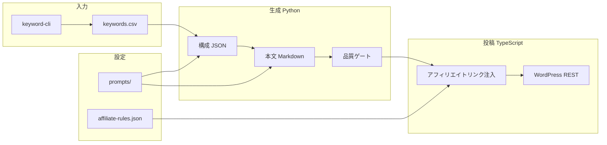

# blog-affiliate-pipeline リポジトリ設計書

格安 SIM × 光回線 × お困り系アフィリエイトの自動化パイプライン実装用リポジトリの構成設計。

| 項目     | 値                                            |
| -------- | --------------------------------------------- |
| 作成日   | 2026-07-12                                    |
| 状態     | 承認済み（Phase 0 実装の前提）                |
| 実装リポ | `felix-jp-studio/blog-affiliate-pipeline`     |
| 計画リポ | `felix-jp-studio/blog-affiliate-auto`（本書） |
| 参照実装 | `article-auto-post`（Groq・状態管理・CI）     |

---

## 1. 要件

### 目的

| 項目     | 内容                                                      |
| -------- | --------------------------------------------------------- |
| ニッチ   | 格安 SIM × 光回線 × お困り系                              |
| 投稿先   | WordPress（REST API + Application Password）              |
| 生成     | Python（構成・本文・品質）+ Groq / Claude                 |
| 投稿     | TypeScript（WP REST）                                     |
| 計画管理 | 本リポ（`blog-affiliate-auto`）に手順・ロードマップを置く |

### フェーズ別スコープ

| フェーズ    | 時期            | リポに置くもの                              |
| ----------- | --------------- | ------------------------------------------- |
| **Phase 0** | Week 1 Day 4〜6 | リポ作成、config、prompts、`publisher` 骨格 |
| **Phase 1** | Month 2         | KW → 生成 → 品質 → WP 投稿の E2E            |
| **Phase 2** | Month 4+        | scraper、GSC レポート、日次自動投稿         |

### Week 1 で別途決める事項

- ドメイン名・サーバー（Day 1）
- Groq のみ / Claude 併用（Day 5）
- 低予算 / 標準プラン

---

## 2. アーキテクチャ

### データフロー



### パッケージ一覧

| パッケージ    | 言語       | Phase | 責務                                   |
| ------------- | ---------- | ----- | -------------------------------------- |
| `publisher`   | TypeScript | **0** | WP 投稿、AF リンク注入、投稿状態管理   |
| `generator`   | Python     | 1     | Groq/Claude で構成・本文、品質チェック |
| `keyword-cli` | Python     | 1     | CSV/DB 管理、KW スコアリング           |
| `scraper`     | Python     | 2     | 料金・キャンペーン監視                 |

---

## 3. ディレクトリ構成

```
blog-affiliate-pipeline/
├── README.md
├── .gitignore
├── .env.example
│
├── package.json                 # TS ルート（npm workspaces）
├── tsconfig.base.json
├── pyproject.toml               # Python ルート（uv 推奨）
│
├── packages/
│   ├── publisher/               # TypeScript — Phase 0 から着手
│   │   ├── package.json
│   │   ├── tsconfig.json
│   │   ├── src/
│   │   │   ├── index.ts         # CLI エントリ
│   │   │   ├── config.ts        # Zod + env
│   │   │   ├── wpClient.ts      # WP REST ラッパー
│   │   │   ├── affiliateInjector.ts
│   │   │   └── publishOrchestrator.ts
│   │   └── tests/
│   │
│   ├── generator/               # Python — Phase 1
│   │   ├── pyproject.toml
│   │   ├── src/generator/
│   │   │   ├── outline.py
│   │   │   ├── article.py
│   │   │   ├── quality.py
│   │   │   └── groq_client.py
│   │   └── tests/
│   │
│   ├── keyword-cli/             # Python — Phase 1
│   │   ├── pyproject.toml
│   │   ├── src/keyword_cli/
│   │   │   ├── import_csv.py
│   │   │   └── score.py
│   │   └── tests/
│   │
│   └── scraper/                 # Python — Phase 2（骨格のみ Phase 0）
│       └── README.md
│
├── config/
│   ├── affiliate-rules.json
│   ├── quality-thresholds.json
│   └── prompts/
│       ├── outline-sim.md
│       └── article-sim.md
│
├── data/
│   ├── keywords.db              # SQLite（gitignore）
│   ├── keywords.seed.csv
│   └── .gitkeep
│
├── drafts/                      # 生成済み下書き（gitignore 推奨）
│   └── .gitkeep
│
├── state/
│   ├── publish-state.json
│   └── generation-cache/
│
├── scripts/
│   └── dev/
│       └── smoke-wp-post.ts
│
├── docs/
│   ├── setup.md
│   ├── pipeline-flow.md
│   └── secrets.md
│
└── .github/workflows/
    ├── ci.yml
    ├── publish-draft.yml        # Phase 1
    └── weekly-report.yml        # Phase 2
```

---

## 4. コンポーネント詳細

### 4-1. `publisher`（TypeScript）

**CLI**

```bash
npm run wp:ping
npm run wp:post -- --file drafts/manual-001.md --status draft
npm run wp:post -- --file drafts/xxx.md --publish
```

| コマンド  | 入力                   | 出力                                       |
| --------- | ---------------------- | ------------------------------------------ |
| `wp:ping` | env（WP URL, 認証）    | 接続 OK/NG                                 |
| `wp:post` | Markdown + frontmatter | WP post ID、URL、`publish-state.json` 更新 |

**環境変数**

| 変数              | 用途                 | Phase |
| ----------------- | -------------------- | ----- |
| `WP_URL`          | WordPress サイト URL | 0     |
| `WP_USER`         | WP ユーザー名        | 0     |
| `WP_APP_PASSWORD` | Application Password | 0     |

### 4-2. `generator`（Python、Phase 1）

```bash
uv run generate-outline --keyword-id 1
uv run generate-article --outline drafts/outline-001.json
uv run quality-check --file drafts/article-001.md
```

| 変数                       | 用途       | Phase |
| -------------------------- | ---------- | ----- |
| `GROQ_API_KEY`             | 生成       | 1     |
| `GROQ_MODEL_DEV` / `_PROD` | モデル切替 | 1     |

### 4-3. アフィリエイトリンク注入

`affiliateInjector.ts` が投稿直前にリンクを挿入する（`article-auto-post` の CTA 注入と同型）。生成キャッシュはリンク変更で無効化しない。

---

## 5. データ設計

### SQLite `keywords.db`

```sql
-- keywords
id, keyword, article_type, priority, status, created_at
-- status: pending | outlined | drafted | published | skipped
```

Week 1 は `keywords.seed.csv` のみでも可。Day 4 で CSV 投入、Phase 1 で DB 化。

### `publish-state.json`

```json
{
  "articles": [
    {
      "keywordId": 1,
      "slug": "rakuten-mobile-mnp",
      "wpPostId": 42,
      "url": "https://example.jp/...",
      "status": "publish",
      "publishedAt": "2026-07-15T00:00:00+09:00"
    }
  ]
}
```

`article-auto-post` の `published-articles.json` と同型。日次制限・重複防止に使用。

### `affiliate-rules.json`（例）

```json
{
  "carriers": {
    "rakuten-mobile": { "asp": "a8", "linkTemplate": "..." },
    "linemo": { "asp": "moshimo", "linkTemplate": "..." }
  },
  "articleTypes": {
    "comparison": {
      "minLinks": 3,
      "requiredCarriers": ["rakuten-mobile", "linemo", "ahamo"]
    },
    "howto": { "minLinks": 2 }
  }
}
```

### 生成キャッシュ（Phase 1）

```
state/generation-cache/{keywordId}-{promptHash}.json
```

`promptHash` = keyword + prompt ファイル内容の SHA256。

---

## 6. 品質基準（公開条件）

ロードマップより:

- 品質スコア ≥ 70
- 禁止語なし
- 文字数 4,000〜8,000
- 重複率 < 15%
- ASP リンク 2〜5 本

`config/quality-thresholds.json` に閾値を定義する。

---

## 7. CI / Secrets

### Workflows

| Workflow            | Phase | 内容                           |
| ------------------- | ----- | ------------------------------ |
| `ci.yml`            | 0     | lint + test（TS、後に Python） |
| `publish-draft.yml` | 1     | 手動 dispatch で 1 本投稿      |
| `weekly-report.yml` | 2     | GSC / 収益レポート             |

### GitHub Secrets（一覧）

| Secret            | 用途                 |
| ----------------- | -------------------- |
| `WP_URL`          | WordPress URL        |
| `WP_USER`         | WP ユーザー          |
| `WP_APP_PASSWORD` | Application Password |
| `GROQ_API_KEY`    | 生成（Phase 1）      |

詳細は実装リポの `docs/secrets.md` に記載する。

---

## 8. article-auto-post からの再利用

| パターン                  | 流用先                             |
| ------------------------- | ---------------------------------- |
| Zod + dry-run/publish     | `packages/publisher/src/config.ts` |
| Groq JSON 生成 + リトライ | `packages/generator/`              |
| promptHash キャッシュ     | `state/generation-cache/`          |
| 投稿直前リンク注入        | `affiliateInjector.ts`             |
| 投稿状態 JSON             | `state/publish-state.json`         |
| Actions: lint → test      | `.github/workflows/ci.yml`         |

---

## 9. 懸念と対策

| 懸念                    | 対策                                           |
| ----------------------- | ---------------------------------------------- |
| Python + TS の二言語 CI | matrix 分離。Phase 0 は publisher のみ必須     |
| WP 認証漏洩             | Application Password のみ、ログマスク          |
| AI 料金ハルシネーション | 「公式サイト（YYYY/MM）」表記必須              |
| スパム判定              | simhash、`MAX_POSTS_PER_RUN=1`                 |
| ASP 規約                | `affiliate-rules.json` + 投稿前 lint           |
| Week 1 で WP 未準備     | `wp:ping` 失敗でもリポは成立。Day 2 以降で接続 |

---

## 10. Phase 0 で作る / 作らない

| 作る                                  | 作らない（Phase 1 以降） |
| ------------------------------------- | ------------------------ |
| リポ骨格、README、`.env.example`      | generator 本実装         |
| `config/prompts/*.md` プレースホルダ  | keyword-cli DB 投入      |
| `packages/publisher` 骨格 + `wp:ping` | `daily-publish` cron     |
| `ci.yml`（publisher test のみ）       | scraper、GSC 連携        |
| `keywords.seed.csv` サンプル          |                          |

---

## 11. Week 1 との接続

| Day   | 実装リポでやること                                  |
| ----- | --------------------------------------------------- |
| Day 1 | なし（ドメイン・サーバー）                          |
| Day 4 | リポ作成、本設計どおり初期化、`keywords.seed.csv`   |
| Day 5 | `config/prompts/*.md` 記入、手動記事を `drafts/` に |
| Day 6 | `publisher` の `wp:ping` / `wp:post --status draft` |
| Day 7 | `ci.yml` green、Week 2 で generator 着手            |

---

## 12. 変更履歴

| 日付       | 内容     |
| ---------- | -------- |
| 2026-07-12 | 初版承認 |
