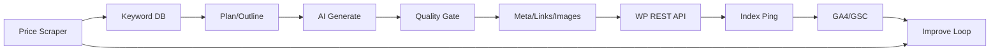

# 12ヶ月ロードマップ（2026-07-12 生成）

格安 SIM × 光回線 × お困り系アフィリエイトの全自動化・収益化計画。

| 項目       | 値                                        |
| ---------- | ----------------------------------------- |
| 生成日     | 2026-07-12                                |
| 確定ニッチ | 格安 SIM × 光回線 × お困り系              |
| 目標月収   | 最低 5 万円 / ベスト 10 万円（12 ヶ月目） |
| 起点       | 2026 年 7 月（Month 1）                   |

---

## 1. 戦略サマリー

### 採用ニッチ

**格安 SIM × 光回線 × お困り系**（[niche-pre-research.md](../research/niche-pre-research.md) 案 1 を採用）

- Phase 1〜3（〜6 ヶ月）: 格安 SIM 乗り換え・比較・MNP 手順
- Phase 2 後半〜（4 ヶ月目〜）: 光回線・セット割・ホームルーター
- 常時: お困り系（速度・開通・解約・障害）でロングテール獲得

### ニッチ 3 案比較（表 D 抜粋）

| ニッチ      | 競合                | 単価     | 検索 Vol | 自動化 | 規約リスク | 5 万到達     | 推奨  |
| ----------- | ------------------- | -------- | -------- | ------ | ---------- | ------------ | ----- |
| 格安 SIM×光 | 高/ロングテール豊富 | 4k〜12k  | 大       | 9/10   | 低         | 中（現実的） | **◎** |
| IT リスキル | 高                  | 10k〜25k | 中       | 7/10   | 低         | 中           | ○     |
| SaaS 比較   | 高                  | 1.5k〜5k | 大       | 10/10  | 低         | やや難       | △     |

### 5 万 / 10 万円到達の概算（採用ニッチ）

| 目標           | 必要粗利/月  | 平均単価 7,000 円時の成約数 | 想定 PV/月  | 想定記事数（累計） |
| -------------- | ------------ | --------------------------- | ----------- | ------------------ |
| 月 5 万（純）  | 約 7.1 万円  | 約 10 件                    | 1.5〜2.5 万 | 250〜300 本        |
| 月 10 万（純） | 約 14.3 万円 | 約 20 件                    | 3〜4 万     | 350〜400 本        |

根拠: 実売サイト 193 本・月 3〜4 万 PV で月 20 万円前後の事例あり。保守的に 12 ヶ月目で PV 2.5 万・成約 10 件を標準シナリオとする。

### 収益モデル（優先順位）

1. **ASP 成果報酬（主収益）**
   - A8.net（案件数）、もしもアフィリエイト（W 報酬）、Link-AG（格安 SIM 単価）
   - 格安 SIM: 楽天モバイル、LINEMO、ahamo、povo 等
   - 光回線: NURO 光、au ひかり、ソフトバンク光、ビッグローブ光
   - ホームルーター: WiMAX、モバレコ Air 等
2. **Amazon アソシエイト（補助）** — 端末・ルーター物販（単価低、承認率高）
3. **AdSense（補助・後半）** — PV 安定後に導入（審査 1〜2 ヶ月見込み）

### 自動化の設計思想

| 100% 自動化                 | 週 1 回人間チェック（平日 1h 内） | 人間のみ                 |
| --------------------------- | --------------------------------- | ------------------------ |
| KW 収集・スコアリング       | 品質サンプリング 5 記事/週        | ASP 規約変更への方針判断 |
| 構成・本文生成              | 収益レポート確認                  | クレーム・法務対応       |
| メタ・内部リンク挿入        | 異常アラート対応                  | ドメインピボット判断     |
| WP 下書き→公開（条件付き）  | 月次戦略レビュー（休日 2〜4h）    |                          |
| 料金差分検知→リライトキュー |                                   |                          |
| GSC/GA4 レポート生成        |                                   |                          |

公開条件（自動）: 品質スコア ≥ 70、禁止語なし、文字数 4,000〜8,000、重複率 < 15%、ASP リンク 2〜5 本。

### 12 ヶ月後の到達イメージ

| 指標             | 標準シナリオ     |
| ---------------- | ---------------- |
| 公開記事数       | 350 本           |
| インデックス率   | 75%（約 260 本） |
| 月間 PV          | 25,000           |
| 月間収益（純）   | 5〜10 万円       |
| 週あたり作業時間 | 5〜7 時間        |

---

## 2. フェーズ別ロードマップ（月次）

### Month 1（2026/07）— Phase 0: 準備

**主要ゴール**: ドメイン・WP・ASP 登録完了。パイプライン設計確定。

**タスク**

- [ ] ドメイン取得（例: `sim-hikari-guide.jp` 等、通信系を含む名前）
- [ ] Xserver または ConoHa WING で WordPress 構築
- [ ] A8.net、もしもアフィリエイト、Link-AG 登録・サイト審査
- [ ] GA4、Search Console 設置
- [ ] GitHub リポ `blog-affiliate-pipeline` 作成（実装用）
- [ ] キーワード DB スキーマ設計（SQLite → 後に PostgreSQL 可）

**KPI**

| 記事数        | インデックス | PV  | 収益 | 工数/週 |
| ------------- | ------------ | --- | ---- | ------- |
| 0（設計のみ） | 0            | 0   | 0    | 8h      |

**判断**: 審査却下 → ドメイン・コンテンツ方針を修正して再申請

---

### Month 2（2026/08）— Phase 1 開始: パイプライン v0

**主要ゴール**: 手動トリガーで 1 記事が WP 公開される E2E 完了。

**タスク**

- [ ] Python: キーワード CSV 投入 → 構成 JSON 生成（Claude API / Groq）
- [ ] Python: 本文生成 + 品質チェック（文字数・禁止語）
- [ ] TypeScript: WordPress REST API 投稿スクリプト
- [ ] アフィリエイトリンク挿入ルール v1（楽天モバイル・LINEMO）
- [ ] テスト記事 10 本を手動承認で公開

**KPI**

| 記事数 | インデックス | PV  | 収益 | 工数/週 |
| ------ | ------------ | --- | ---- | ------- |
| 10     | 3            | 100 | 0    | 8h      |

**自動化フロー**: `keywords.csv` → `generate.py` → `draft.md` → `post-wp.ts` → WP

---

### Month 3（2026/09）— Phase 1: 量産開始

**主要ゴール**: 週 7 本ペースの半自動投稿。累計 40 本。

**タスク**

- [ ] GitHub Actions: 平日毎日 1 本生成・投稿 cron
- [ ] 内部リンク自動（同一カテゴリ 3 本以上から関連付け）
- [ ] メタ description・title 自動生成
- [ ] 料金スクレイパー v1（楽天モバイル公式キャンペーンページ）

**KPI**

| 記事数     | インデックス | PV  | 収益   | 工数/週 |
| ---------- | ------------ | --- | ------ | ------- |
| 40（累計） | 15           | 800 | 0〜500 | 7h      |

---

### Month 4（2026/10）— Phase 2: 検証・収益化開始

**主要ゴール**: 初収益 1,000 円以上。累計 80 本。引っ越しシーズン前の光回線記事追加。

**タスク**

- [ ] 光回線比較記事カテゴリ追加（NURO 光、au ひかり）
- [ ] お困り系テンプレ追加（「○○ 速度 遅い」「開通 いつ」）
- [ ] GSC 連携: 11〜30 位 KW のリライトキュー自動化
- [ ] 成約トラッキング（ASP レポート週次 CSV 取得）

**KPI**

| 記事数 | インデックス | PV    | 収益（純） | 工数/週 |
| ------ | ------------ | ----- | ---------- | ------- |
| 80     | 40           | 3,000 | 1,000      | 6h      |

**判断**: 3 ヶ月でインデックス < 10 → 品質閾値・投稿頻度を見直し

---

### Month 5（2026/11）— Phase 2

**主要ゴール**: 月 5,000 円。累計 120 本。

**KPI**

| 記事数 | インデックス | PV    | 収益  | 工数/週 |
| ------ | ------------ | ----- | ----- | ------- |
| 120    | 70           | 6,000 | 5,000 | 6h      |

---

### Month 6（2026/12）— Phase 2 完了

**主要ゴール**: 月 1 万円。完全無人投稿（週次サンプリングのみ）。

**KPI**

| 記事数 | インデックス | PV     | 収益   | 工数/週 |
| ------ | ------------ | ------ | ------ | ------- |
| 160    | 100          | 10,000 | 10,000 | 5h      |

**中間レビュー**: 下記「3 ヶ月時点質問リスト」を Month 6 で実施

---

### Month 7（2027/01）— Phase 3: 加速

**主要ゴール**: 月 2 万円。勝ち KW の横展開。

**タスク**

- [ ] 上位 10 記事の類似 KW 各 5 本自動生成
- [ ] セット割（スマホ+光）複合記事の比率を 30% に
- [ ] リライト自動化（料金改定検知 → 該当記事更新）

**KPI**

| 記事数 | インデックス | PV     | 収益   | 工数/週 |
| ------ | ------------ | ------ | ------ | ------- |
| 200    | 140          | 14,000 | 20,000 | 5h      |

---

### Month 8（2027/02）

**KPI**: 累計 230 本 / PV 17,000 / 収益 30,000 円

---

### Month 9（2027/03）— 繁忙期（引っ越し）

**主要ゴール**: 月 4 万円。3〜4 月需要を取りにいく。

**KPI**

| 記事数 | インデックス | PV     | 収益   | 工数/週              |
| ------ | ------------ | ------ | ------ | -------------------- |
| 270    | 190          | 22,000 | 40,000 | 6h（繁忙期のみ微増） |

---

### Month 10（2027/04）— Phase 4: 最適化

**主要ゴール**: 月 5 万円ライン到達。

**KPI**

| 記事数 | インデックス | PV     | 収益       | 工数/週 |
| ------ | ------------ | ------ | ---------- | ------- |
| 300    | 220          | 24,000 | **50,000** | 5h      |

---

### Month 11（2027/05）

**KPI**: 累計 330 本 / PV 26,000 / 収益 70,000 円

---

### Month 12（2027/06）— 目標達成

**主要ゴール**: 月 5 万確実・10 万挑戦。

**KPI**

| 記事数 | インデックス | PV     | 収益（保守/標準/楽観） | 工数/週 |
| ------ | ------------ | ------ | ---------------------- | ------- |
| 350    | 260          | 28,000 | 5万 / **8万** / 10万   | 5h      |

---

## 3. 自動化アーキテクチャ

### 3-1. 全体パイプライン



### 3-2. 工程別設計

| #   | 工程         | 実装   | 技術                                                     | 月額コスト      | 難易度 | 失敗ポイント           |
| --- | ------------ | ------ | -------------------------------------------------------- | --------------- | ------ | ---------------------- |
| 1   | KW 調査      | 自作   | Python + ラッコキーワード API / CSV 手動補完             | 0〜2,800 円     | 中     | 競合度の見誤り         |
| 2   | 企画・構成   | 自作   | Claude API / Groq（article-auto-post 流用）              | 3,000〜8,000 円 | 低     | テンプレ単調化         |
| 3   | 本文生成     | 自作   | Groq llama-3.3-70b（本番）/ 8b（テスト）                 | 上記に含む      | 低     | ハルシネーション       |
| 4   | 品質管理     | 自作   | Python: 文字数・NG 語・類似度（simhash）                 | 0               | 中     | 閾値が緩いとスパム判定 |
| 5   | 画像・メタ   | 自作   | TS: OG 画像は Placid / Bannerbear API または静的テンプレ | 0〜1,000 円     | 中     | 画像なしで評価低下     |
| 6   | WP 投稿      | 自作   | TS: `@wordpress/api` or fetch REST                       | 0               | 低     | 認証トークン漏洩       |
| 7   | AF リンク    | 自作   | JSON ルール: 記事タイプ×キャリア別                       | 0               | 低     | 規約違反表現           |
| 8   | インデックス | 半自動 | Google Indexing API（制限あり）+ XML サイトマップ        | 0               | 中     | API 枠超過             |
| 9   | 分析         | 自作   | GSC API + GA4 Data API → 週次 Markdown レポート          | 0               | 中     | OAuth 更新忘れ         |
| 10  | 収益レポート | 半自動 | ASP CSV 手動 DL → Python 集計（API なしが多い）          | 0               | 低     | 承認率の見落とし       |

### 3-3. リポジトリ構成案

```
blog-affiliate-pipeline/
├── packages/
│   ├── keyword-cli/       # Python: KW 収集・スコアリング
│   ├── generator/         # Python: 構成・本文・品質
│   ├── publisher/         # TypeScript: WP 投稿
│   └── scraper/           # Python: 料金・キャンペーン監視
├── config/
│   ├── affiliate-rules.json
│   ├── quality-thresholds.json
│   └── prompts/
│       ├── outline.md
│       └── article-sim.md
├── data/
│   └── keywords.db        # SQLite
├── .github/workflows/
│   ├── daily-publish.yml
│   └── weekly-report.yml
└── docker-compose.yml     # 任意: ローカル WP 検証
```

### 3-4. 主要 API・エンドポイント

- WordPress: `POST /wp-json/wp/v2/posts`（Application Passwords）
- Groq: `https://api.groq.com/openai/v1/chat/completions`
- GSC: `searchconsole.googleapis.com/webmasters/v3/`
- ラッコキーワード: 競合・検索 Vol 取得（有料プラン時）

---

## 4. コンテンツ戦略

### 記事タイプ比率（安定後）

| タイプ           | 比率 | 収益寄与           | 例                     |
| ---------------- | ---- | ------------------ | ---------------------- |
| 比較・ランキング | 40%  | 高                 | 格安 SIM おすすめ 比較 |
| 乗り換え手順     | 25%  | 最高               | 楽天モバイル MNP 手順  |
| お困り系         | 25%  | 中（CV 近い）      | 速度遅い 対処法        |
| 用語・基礎       | 10%  | 低（内部リンク用） | MNP とは               |

### 品質基準

- 文字数: 4,000〜8,000
- 見出し: H2 5〜8、H3 各 H2 に 2〜3
- 比較表: 5 キャリア以上を Markdown 表で必須
- 更新日: 公開日 + 料金改定時に `modified` 更新
- 禁止: 虚偽体験談、「絶対お得」等の景表法リスク表現、他社誹謗

### 月間投稿数

| 期間     | 本数/月                |
| -------- | ---------------------- |
| M2〜M3   | 15→30                  |
| M4〜M6   | 35                     |
| M7〜M9   | 30                     |
| M10〜M12 | 20（リライト 10 含む） |

### キーワード例（30）

1. 格安 SIM 20GB おすすめ
2. 楽天モバイル 乗り換え 手順
3. eSIM 乗り換え 即日
4. MNP 予約番号 取得方法
5. 格安 SIM 通話かけ放題 安い
6. iPhone そのまま 格安 SIM
7. 家族 2 回線 安い
8. 格安 SIM 速度 遅い 対処
9. NURO 光 料金 キャンペーン
10. 光回線 乗り換え おすすめ
11. スマホ セット割 比較
12. au ひかり 解約 方法
13. 光回線 開通 いつ
14. Wi-Fi 速度 遅い 改善
15. ホームルーター おすすめ 一人暮らし
16. WiMAX 料金 比較 2026
17. 引っ越し 光回線 手続き
18. LINEMO 評判 デメリット
19. ahamo 大盛り オプション 不要
20. 格安 SIM 学生 おすすめ
21. データ無制限 格安 SIM
22. テザリング 格安 SIM おすすめ
23. 光回線 マンション おすすめ
24. 工事 不要 光回線
25. ソフトバンク光 障害 確認
26. 楽天モバイル 圏外 代替
27. povo 2.0 使い方
28. 格安 SIM 法人 おすすめ
29. 光回線 プロバイダ 違い
30. WiMAX 解約 違約金

### コンプライアンス（AI 全自動）

- 景表法: 最上級表現禁止。「編集部調べ」「公式サイト記載（YYYY/MM 時点）」を明記
- 商標: 比較・手順目的の公正使用。ロゴ無断使用禁止
- ASP 規約: 虚偽申込誘導禁止。リンクは `rel="sponsored"` または ASP 指定属性
- AI 開示: フッターに「本記事は AI 支援により作成」の一文（サイトポリシーに記載）

---

## 5. SEO・集客戦略

- **ドメイン**: 新規 `.jp` または `.com`、通信系キーワードを含む
- **構造**: カテゴリ `格安SIM` / `光回線` / `お困り系`、タグはキャリア名
- **内部リンク**: 公開時に同カテゴリから 3 本自動挿入、ハブ記事（格安 SIM 完全ガイド）を M3 に 1 本
- **被リンク**: 自動購入禁止。X 自動投稿（article-auto-post 流用）で週 2 引用のみ
- **SNS**: 週 2 投稿まで（工数対効果可）。Instagram/TikTok はやらない
- **アルゴリズム耐性**: 薄い量産回避のため同一テンプレ連続 5 本超えたらプロンプトローテーション
- **インデックス**: サイトマップ ping + Search Console URL 検査（週 10 URL 手動上限内で優先記事）

---

## 6. 収益化設計

### ASP 優先順位

1. Link-AG / もしも（楽天モバイル等、単価比較）
2. A8.net（光回線・案件数）
3. Amazon（端末補助）

### 表 C: 収益予測（3 シナリオ × 12 ヶ月、単位: 円・純利益）

| 月  | 記事累計 | 月間 PV | 保守   | 標準       | 楽観        |
| --- | -------- | ------- | ------ | ---------- | ----------- |
| M1  | 0        | 0       | 0      | 0          | 0           |
| M2  | 10       | 100     | 0      | 0          | 0           |
| M3  | 40       | 800     | 0      | 0          | 500         |
| M4  | 80       | 3,000   | 0      | 1,000      | 3,000       |
| M5  | 120      | 6,000   | 2,000  | 5,000      | 8,000       |
| M6  | 160      | 10,000  | 5,000  | 10,000     | 18,000      |
| M7  | 200      | 14,000  | 10,000 | 20,000     | 30,000      |
| M8  | 230      | 17,000  | 15,000 | 30,000     | 45,000      |
| M9  | 270      | 22,000  | 25,000 | 40,000     | 60,000      |
| M10 | 300      | 24,000  | 35,000 | **50,000** | 75,000      |
| M11 | 330      | 26,000  | 45,000 | 65,000     | 85,000      |
| M12 | 350      | 28,000  | 50,000 | **80,000** | **100,000** |

**到達月**: 月 5 万（標準）= **M10（2027/04）** / 月 10 万（楽観）= **M12**

### 損益分岐

| 項目                         | 月額                    |
| ---------------------------- | ----------------------- |
| サーバー（Xserver ビジネス） | 約 2,200 円             |
| ドメイン按分                 | 約 200 円               |
| AI API（Groq/Claude）        | 5,000〜10,000 円        |
| ラッコキーワード（任意）     | 0〜2,800 円             |
| **合計**                     | **約 8,000〜15,000 円** |

黒字化: 月 1 万円収益で概ねトントン（M5〜M6）。

---

## 7. 運用ルール

| 頻度 | 時間             | 内容                                               |
| ---- | ---------------- | -------------------------------------------------- |
| 日次 | 10 分            | Slack/メール異常アラート（投稿失敗・品質 NG 多発） |
| 週次 | 60 分（平日 1h） | 記事 5 本サンプリング、ASP レポート、GSC 順位確認  |
| 月次 | 休日 2〜4h       | KW 方針更新、勝ち負け記事分析、プロンプト改訂      |

### 品質監査チェックリスト（10 項目）

1. 料金数値が公式と一致しているか
2. 虚偽の体験談がないか
3. ASP リンクが有効か
4. タイトル 32 文字前後か
5. メタ description があるか
6. 比較表があるか（比較系記事）
7. 内部リンク 3 本以上か
8. 禁止語（絶対、最高、No.1 等）がないか
9. 更新日・免責が入っているか
10. スマホ表示で表が崩れていないか

---

## 8. 最初の 90 日間・週次プラン

| Week | 期間    | ToDo                                     | 完了条件              | 期待 KPI      |
| ---- | ------- | ---------------------------------------- | --------------------- | ------------- |
| W1   | M1 前半 | ドメイン・WP・ASP 登録、GSC/GA4          | WP 管理画面ログイン可 | —             |
| W2   | M1 後半 | repo 作成、KW DB スキーマ、プロンプト v1 | `keywords.db` 100 行  | —             |
| W3   | M2 前半 | 構成生成 + 本文生成 CLI                  | 1 本 `draft.md` 出力  | —             |
| W4   | M2 後半 | WP 投稿 TS + E2E                         | 1 本公開              | 記事 1        |
| W5   | M2末    | AF リンクルール、品質ゲート              | 10 本公開             | 記事 10       |
| W6   | M3 前半 | GitHub Actions daily cron                | 自動 3 本成功         | 記事 20       |
| W7   | M3 中盤 | 内部リンク自動化                         | 関連リンク自動付与    | 記事 30       |
| W8   | M3 後半 | 料金スクレイパー v1                      | 差分検知テスト通過    | 記事 40       |
| W9   | M4 前半 | 光回線カテゴリ追加                       | 光記事 10 本          | PV 1,500      |
| W10  | M4 中盤 | お困り系テンプレ                         | お困り系 15 本累計    | PV 2,500      |
| W11  | M4 後半 | GSC リライトキュー                       | リライト 5 本         | 初収益        |
| W12  | M4末    | 中間レビュー実施                         | 質問 20 項目回答記録  | 収益 1,000 円 |

---

## 9. 失敗パターンと回避策

| #   | 失敗                               | 早期警告                 | 対策                          |
| --- | ---------------------------------- | ------------------------ | ----------------------------- |
| 1   | 薄い AI 記事でインデックスされない | M3 インデックス率 < 20%  | 文字数増・比較表必須化        |
| 2   | ASP 審査却下                       | 登録 2 週間で結果なし    | オリジナル記事 5 本追加       |
| 3   | ニッチミス                         | M6 収益 < 3,000 円       | 光回線比率を上げる            |
| 4   | 過剰投稿でスパム判定               | 1 日 10 本以上で順位急落 | 1 日 1〜2 本上限              |
| 5   | 料金古化で信頼低下                 | 直帰率上昇               | スクレイパー + 月次リライト   |
| 6   | ハルシネーション                   | 指摘・コメント           | 公式 URL 引用必須ルール       |
| 7   | API コスト超過                     | 月 2 万超                | Groq 8b に切替・バッチ化      |
| 8   | WP 障害で投稿停止                  | Actions 失敗 3 日連続    | 死活監視 + 手動フォールバック |
| 9   | 商標クレーム                       | 警告メール               | 該当表現削除・比較表現へ      |
| 10  | 繁忙期取りこぼし                   | M8 PV 伸び悩み           | M7 に引っ越し KW 先行投入     |

---

## 10. 最終成果物（表形式）

### 表 A: 月次ロードマップ一覧

| 月  | フェーズ | 目標         | 主要タスク       | 予算/月 | 週工数 |
| --- | -------- | ------------ | ---------------- | ------- | ------ |
| M1  | P0       | 基盤準備     | WP・ASP・設計    | 1.5 万  | 8h     |
| M2  | P1       | E2E 1 本     | 生成+投稿 CLI    | 1.5 万  | 8h     |
| M3  | P1       | 40 本        | cron・内部リンク | 2 万    | 7h     |
| M4  | P2       | 初収益       | 光回線・お困り系 | 2 万    | 6h     |
| M5  | P2       | 月 5千       | 量産継続         | 2 万    | 6h     |
| M6  | P2       | 月 1 万      | 中間レビュー     | 2 万    | 5h     |
| M7  | P3       | 月 2 万      | 勝ち KW 横展開   | 2.5 万  | 5h     |
| M8  | P3       | 月 3 万      | リライト自動化   | 2.5 万  | 5h     |
| M9  | P3       | 月 4 万      | 繁忙期対応       | 2.5 万  | 6h     |
| M10 | P4       | **月 5 万**  | 最適化           | 2 万    | 5h     |
| M11 | P4       | 月 7 万      | コスト削減       | 2 万    | 5h     |
| M12 | P4       | **月 10 万** | 安定運用         | 2 万    | 5h     |

### 表 B: 自動化パイプライン一覧

| 工程         | 実装   | 技術           | 月額    | 難易度 | 優先度 | 担当       |
| ------------ | ------ | -------------- | ------- | ------ | ------ | ---------- |
| KW 収集      | 自作   | Python         | 0〜2.8k | 中     | P0     | 機械       |
| 構成生成     | 自作   | Groq/Claude    | 3〜8k   | 低     | P0     | 機械       |
| 本文生成     | 自作   | Groq           | 含む    | 低     | P0     | 機械       |
| 品質ゲート   | 自作   | Python         | 0       | 中     | P0     | 機械       |
| WP 投稿      | 自作   | TypeScript     | 0       | 低     | P0     | 機械       |
| AF リンク    | 自作   | JSON ルール    | 0       | 低     | P1     | 機械       |
| 料金監視     | 自作   | Python cron    | 0       | 中     | P1     | 機械       |
| 分析レポート | 自作   | GSC/GA4 API    | 0       | 中     | P2     | 機械→人    |
| 収益集計     | 半自動 | CSV+Python     | 0       | 低     | P2     | 人 15分/週 |
| 品質監査     | 手動   | チェックリスト | 0       | 低     | P1     | 人 1h/週   |

---

## 11. 最初の 7 日間でやるべき 10 タスク

| 優先 | タスク                              | 所要 | 成果物          | 次に繋がる理由       |
| :--: | ----------------------------------- | ---- | --------------- | -------------------- |
|  1   | ドメイン取得                        | 30m  | ドメイン証明    | WP・ASP に必要       |
|  2   | Xserver 契約・WP インストール       | 2h   | 空サイト        | 投稿先               |
|  3   | A8 + もしも + Link-AG 登録          | 1h   | 申込完了        | 収益化の前提         |
|  4   | GA4 + GSC 設定                      | 45m  | トラッキング ID | KPI 計測             |
|  5   | `blog-affiliate-pipeline` repo 作成 | 1h   | 空リポ          | 実装の置き場         |
|  6   | KW 100 件リストアップ               | 2h   | `keywords.csv`  | 記事ネタ             |
|  7   | プロンプト v1（構成・本文）         | 2h   | `prompts/*.md`  | 生成品質の基盤       |
|  8   | WP Application Password 発行        | 15m  | 認証情報        | REST API 用          |
|  9   | 手動テスト記事 1 本公開             | 2h   | 公開 URL 1      | インデックス・審査用 |
|  10  | 週次運用カレンダー登録              | 15m  | カレンダー      | 1h/日運用の習慣化    |

---

## 12. 追加提案

### 低予算版 vs 標準版

| 項目                        | 低予算（月 1 万以内）                  | 標準（月 2〜3 万）    |
| --------------------------- | -------------------------------------- | --------------------- |
| サーバー                    | ConoHa 最安                            | Xserver ビジネス      |
| KW ツール                   | 無料（Google 候補+Ubersuggest 無料枠） | ラッコキーワード      |
| AI                          | Groq のみ                              | Groq + Claude（構成） |
| 画像                        | 静的テンプレ（Canva 手動 1 回）        | Placid API            |
| 投稿頻度                    | 月 20 本                               | 月 30〜35 本          |
| 12 ヶ月収益（標準シナリオ） | 月 3〜5 万                             | 月 5〜10 万           |

### 3 ヶ月時点中間レビュー（20 問）

1. 公開記事数は 40 本以上か？
2. インデックス率は 30% 以上か？
3. 月間 PV は 500 以上か？
4. 初収益は発生したか？
5. 品質 NG 率は 10% 以下か？
6. 1 記事あたり API コストはいくらか？
7. 上位表示（10 位以内）KW は何個か？
8. 楽天モバイル案件のクリック数は？
9. 光回線記事は何本あるか？
10. 内部リンクは自動化できているか？
11. 料金スクレイパーは動いているか？
12. GitHub Actions 成功率は 95% 以上か？
13. 週 1h 監視で回っているか？
14. プロンプト改訂は何回したか？
15. 競合より文字数・表が充実している記事は何%か？
16. 直帰率は 80% 未満か？
17. ASP 承認率は想定通りか？
18. ドメインパワーは上昇傾向か？
19. ピボットが必要なサインはあるか？
20. M6 までに月 1 万は現実的か？

### 次に決めるべき事項

- [ ] ドメイン名の確定
- [ ] 低予算 / 標準のどちらで運用するか
- [ ] Groq のみか Claude 併用か
- [ ] `blog-affiliate-pipeline` を felix-jp-studio 配下に置くか別 repo か

---

## 推奨ニッチで進める場合の最初の 1 週間

1. **Day 1**: ドメイン + サーバー契約
2. **Day 2**: WordPress 初期設定、カテゴリ 3 つ作成、プライバシーポリシー
3. **Day 3**: ASP 3 社登録、GA4/GSC
4. **Day 4**: KW 100 件、`blog-affiliate-pipeline` 初期化
5. **Day 5**: プロンプト v1 + 手動で記事 1 本生成・公開
6. **Day 6**: WP REST 投稿スクリプトの骨格（TS）
7. **Day 7**: 週次レビュー枠をカレンダーに登録、Week 2 の構成生成 CLI に着手

---

## 変更履歴

| 日付       | 内容                               |
| ---------- | ---------------------------------- |
| 2026-07-12 | 初版生成（プロンプト 02 実行結果） |
