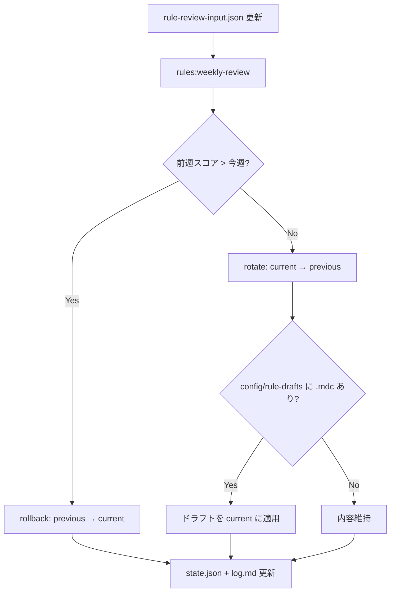

# 手順 04：Cursor ルール週次レビュー（自動更新・巻き戻し）

## 目的

`.cursor/rules/` を **週 1 回** 見直し、評価に基づき更新または巻き戻す。

- **更新**: 現行ルールの週次スコアが前世代以上 → ドラフトを適用
- **巻き戻し**: 前世代スコア > 現行 → `archive/*.previous.mdc` から復元

## 2 世代管理

| 種別                  | パス                                   |
| --------------------- | -------------------------------------- |
| 現行（Cursor が読む） | `.cursor/rules/*.mdc`                  |
| 1 世代前              | `.cursor/rules/archive/*.previous.mdc` |

`npm run rules:rotate` は手動で current → previous に退避（週次スクリプト内でも実行）。

## 評価メトリクス

`config/rule-review-input.json` を **毎週日曜のレビュー前** に更新する。

| メトリクス              | 範囲  | 意味                           |
| ----------------------- | ----- | ------------------------------ |
| taskCompletionRate      | 0〜1  | ロードマップ週次タスク完了率   |
| docQualityScore         | 1〜5  | 生成物・手順書の品質           |
| manualInterventionCount | 0〜10 | 手動修正回数（少ないほど良い） |
| pipelineProgress        | 0〜10 | 実装進捗                       |
| agentFollowedRulesRate  | 0〜1  | エージェントがルールを守れた率 |

重み: `config/rule-review-weights.json`  
合成スコア 0〜100 を算出し、前週（`rule-review-state.json` の `periods.current`）と比較。

## 週次フロー



## 手動実行

```bash
npm ci
# 1. 今週の weekId とメトリクスを input に記入
# 2. 更新案があれば config/rule-drafts/*.mdc を配置
npm run rules:weekly-review:dry-run   # 判定のみ
npm run rules:weekly-review           # 実行
```

## 自動実行（GitHub Actions）

- ワークフlow: `.github/workflows/rule-weekly-review.yml`
- スケジュール: 毎週日曜 09:00 JST（UTC 日曜 00:00）
- `rule-review-input.json` の `weekId` が未更新の場合は **リマインドのみ**（fail しない）
- 変更がある場合は `rules/weekly-YYYY-Www` ブランチで PR を自動作成

### auto-merge（週次 PR のみ）

| 対象                           |               auto-merge               |
| ------------------------------ | :------------------------------------: |
| `rules/weekly-*` ブランチの PR | **有効**（`auto-merge-weekly-pr.yml`） |
| `feature/*` など通常 PR        |         **無効**（手動マージ）         |

リポジトリの `allow_auto_merge` は有効だが、**自動で `--auto` を付けるのは週次 PR だけ**。通常 PR は GitHub UI でも auto-merge を使わない運用とする。

**ブランチ保護あり**: 週次 PR も `CI / validate` 通過と **承認 1 件** の後に auto-merge が実行される。詳細は [branch-protection.md](../branch-protection.md)。

## 判定一覧

| 判定     | 条件               | 動作                               |
| -------- | ------------------ | ---------------------------------- |
| rollback | 前週スコア > 今週  | archive から復元                   |
| update   | 今週 >= 前週       | rotate → ドラフト適用              |
| hold     | 同点               | ドラフトがあれば適用、なければ維持 |
| skip     | 同一 weekId 再実行 | 何もしない                         |

## 完了条件

- [ ] `docs/rule-review/log.md` に今週の行が追記された
- [ ] `config/rule-review-state.json` の `lastReviewWeek` が更新された
- [ ] rollback 時は `.cursor/rules/` が previous と一致

## 関連

- [agent-workflows.mdc](../../.cursor/rules/agent-workflows.mdc) — タスク発火
- [prompt-pdca.md](../../../article-auto-post/docs/prompt-pdca.md) — 同型の 2 世代管理（参考）
